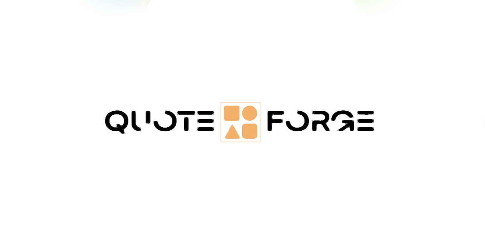

# QuoteForge: Empowering Wisdom and Motivation for Today's Youth



Welcome to QuoteForge, a revolutionary project dedicated to curating and delivering inspiring quotes from famous individuals and influencers. Our goal is to provide the youth of today with a constant stream of wisdom, motivation, and positivity across various platforms. But QuoteForge doesn't stop there - it introduces an innovative AI-powered chatbot that generates personalized quotes based on emotions and engages users with thoughtful responses. With cutting-edge technology and a trendy approach, QuoteForge is not just another quote repository; it's a game-changer in the realm of inspiration and machine learning.

## Features

- **Extensive Quote Collection**: QuoteForge boasts a vast collection of quotes from renowned personalities, historical figures, and modern influencers. From timeless wisdom to contemporary motivation, we've got it all.

- **Multi-Platform Delivery**: Our quotes are available across various platforms - web, mobile. We're where the youth is, ensuring they receive their daily dose of inspiration effortlessly.

- **Personalized AI Quote Generator**: The heart of QuoteForge is its chatbot. Users can interact with the bot, expressing their emotions, and receive customized quotes tailored to their feelings.

- **Human-Like Sentiment Responses**: The chatbot not only generates quotes but also engages users in empathetic conversations. It's designed to provide human-like sentiment replies, fostering a sense of connection.

- **Cutting-Edge Technology**: QuoteForge incorporates the latest advancements in AI and machine learning to create an unparalleled user experience. Our technology is at the forefront of innovation.

## Getting Started

To explore the world of wisdom and motivation with QuoteForge, follow these simple steps:

1. **Clone the Repository**: Begin by cloning this GitHub repository to your local machine.

   ```bash
   git clone [https://github.com/PoIsOn-CoDe/QuoteForge.git]
   ```

2. **Install Dependencies**: Move into the project directory and install the required dependencies.

   ```bash
   cd quoteforge
   npm install
   ```

3. **Run the Application**: Launch the QuoteForge application.

   ```bash
   npm start
   ```

4. **Interact with the Bot**: Open your preferred web browser and navigate to `http://localhost:3000`. Engage with the AI-powered chatbot, explore curated quotes, and experience personalized wisdom.

## Contribution Guidelines

We welcome contributions from the community to make QuoteForge even better. Whether it's adding new quotes, improving the chatbot's functionality, enhancing the user interface, or implementing machine learning features, your contributions are valued.

To contribute:

1. Fork the repository.
2. Create a new branch for your feature: `git checkout -b feature-name`.
3. Commit your changes: `git commit -m "Add feature"`.
4. Push to your forked repository: `git push origin feature-name`.
5. Open a pull request detailing your changes.

## Future Directions

QuoteForge has big plans for the future:

- Incorporating sentiment analysis to provide even more relevant and tailored quotes.
- Expanding the AI chatbot's capabilities to engage in deeper conversations.
- Introducing machine learning models for generating context-aware quotes.
- Partnering with influencers to create an interactive and dynamic community.

Stay tuned for updates as QuoteForge continues to redefine inspiration and personal growth.

## Connect with Us

Follow us on social media to stay informed about the latest QuoteForge developments, exciting contests, and more:

- Twitter: [@QuoteForge](https://twitter.com/QuoteForge)
- Instagram: [@QuoteForgeOfficial](https://www.instagram.com/QuoteForgeOfficial)
- Facebook: [QuoteForge](https://www.facebook.com/QuoteForge)

For inquiries, email us at codingxiteam@gmail.com.

Let's inspire the world, one quote at a time! 🚀🌟
